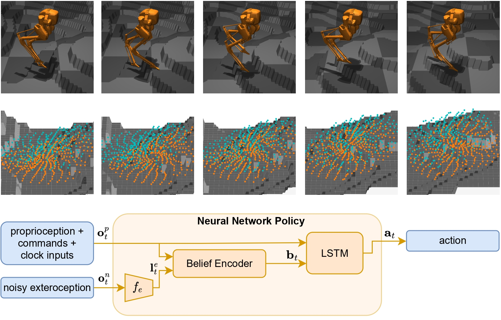

# Learning Perceptive Bipedal Locomotion over Irregular Terrain

This repository contains code to *train* and *run* the perceptive bipedal locomotion policies presented in the [thesis]()/[paper](https://arxiv.org/abs/2304.07236) **Learning Perceptive Bipedal Locomotion over Irregular Terrain**.





## What is this?
We developed a bipedal locomotion policy using Reinforcement Learning. Our policy improves on the state-of-the-art by integrating (noisy) exteroception, and walking over all kinds of difficult terrains. This repo contains the code to reproduce the results.


## How to train
There are two models to be trained: a noise free, privileged teacher model, and a noisy, student model that learns to imitate the teacher model.
### Training the Teacher model
To train an exteroceptive teacher model:
```bash
python train_teacher.py <model name> 60000 exteroception noNorm terrain
```

Training a teacher model will take 12-36 hours for all 60M timesteps. You can adjust the `60000` for shorter or longer runs. Training progress can be monitored in Tensorboard another terminal by running: `tensorboard --logdir teacher_log`. The model will be saved every 10% of progress, and can be found in `/teacher_log`.

Configuration of the environment, curriculum, terrain, etc can be set in `config.py`.

### Training the Student model
First find a trained exteroceptive teacher model in `/teacher_log` that you want to train a student model for. Note the name, e.g.: `exp1-60000k-exteroc-noNorm-terrain_0`. To train a student model on 1e6 teacher model actions, for 100 epochs:
```bash
python train_student.py <student model name> exp1-60000k-exteroc-noNorm-terrain_0 1000000 100
```
Training a student model takes between 1 min and 1 hour. Training of student models can also be monitored in Tensorboard, and trained models can be found in `/student_log`.

## How to run
To run the demo model:

```bash
python run.py teacher exteroception demo-model 100000 1
```
Select the Mujoco windows and hit space to start the sim. Additionally, you can control Cassie with your keyboard (wasdqe) by adding the flag `-keyboardControl` to these commands. This will spawn an extra terminal displaying the velocity commands `(vx, vy, wz)`. Select this terminal and press any of (wasdqe) to control Cassie!


To run your trained models first find their names in `/teacher_log` or `/student_log`.

To run a teacher model that was saved at 60e6 timesteps on 100% curriculum:
```bash
python run.py teacher exteroception <teacher model name> 60000 1
```

To run a student model saved after 100 epochs at 80% curriculum:
```bash
python run.py student exteroception <student model name> 100 0.8
```

## Installation

Requirements:
 - Ubuntu (only tested on 20.04)
 - Mujoco210
 - cassie-mujoco-sim
 - Python env

### 1. Installing Mujoco

You can download Mujoco 2.1.0 [here](https://github.com/deepmind/mujoco/releases/tag/2.1.0)

Install it by unpacking the .tar.gz and placing the `mujoco210` dir in the `~/.mujoco` dir. The path should be:
``` ~/.mujoco/mujoco210```

### 2. Clone this repo and cassie-mujoco-sim:

Clone repos:
```bash
git clone https://github.com/b-vm/bipedal_walker_terrain
cd bipedal_walker_terrain/src
git clone https://github.com/b-vm/cassie_mujoco_sim
```

Make sim:
```bash
cd cassie_mujoco_sim
make build
```


### 3. Set up new Conda env and install the requirements

Set up Conda env:
```bash
conda create --name bipedal_walker python=3.8
```

Activate Conda env: 
```bash
conda activate bipedal_walker
```

Install requirements
```bash
cd src
pip install -r requirements.txt
```

Normally this should be enough to run. However training will be very slow due to some inefficiencies in the recurrent PPO implementation in tensor batching for GPU in sb3_contrib. To make it ~8 times faster, install my fork of sb3_contrib instead. Can be found [here](https://github.com/b-vm/stable-baselines3-contrib/tree/sequence_batching). Make sure to install the branch `sequence_batching`. WARNING: this is not an official release, so expect some tinkering to get it to work.

Clone the forked repo:
```bash
git clone -b sequence_batching https://github.com/b-vm/stable-baselines3-contrib.git
```

Install:
```bash
cd stable-baselines3-contrib
pip install .
```


### 4. Try running the included model
cd back into `/src` repo and:
```bash
python run.py teacher exteroception demo-model 100000 1
```

You should now see a Mujoco window with Cassie, and a Matplotlib windows with terrain sensing!

## Cite

To cite this repo, please cite the paper it belongs to:

```bibtex
@misc{vanmarum2023learning,
      title={Learning Perceptive Bipedal Locomotion over Irregular Terrain}, 
      author={Bart van Marum and Matthia Sabatelli and Hamidreza Kasaei},
      year={2023},
      eprint={2304.07236},
      archivePrefix={arXiv},
      primaryClass={cs.RO}
}
```
## Authors

Bart van Marum, Matthia Sabatelli, [Hamidreza Kasaei](https://github.com/SeyedHamidreza/)

Work done while at [RUG](https://www.rug.nl/)
